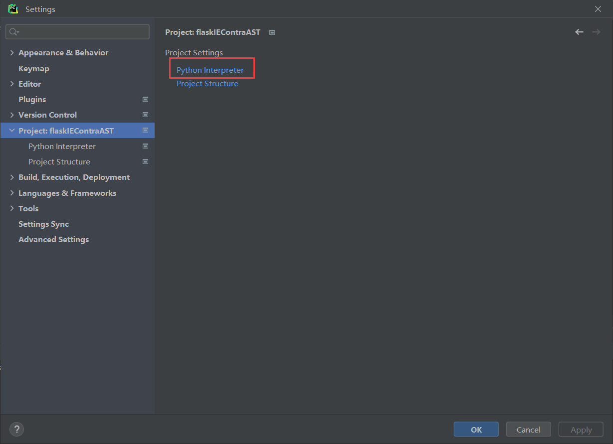
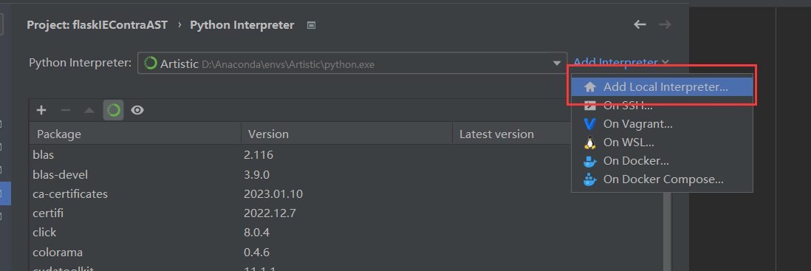
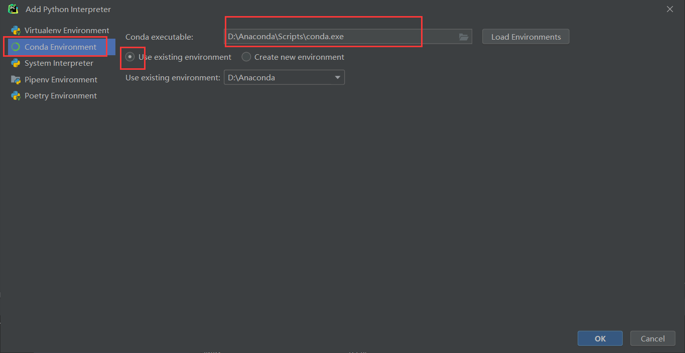
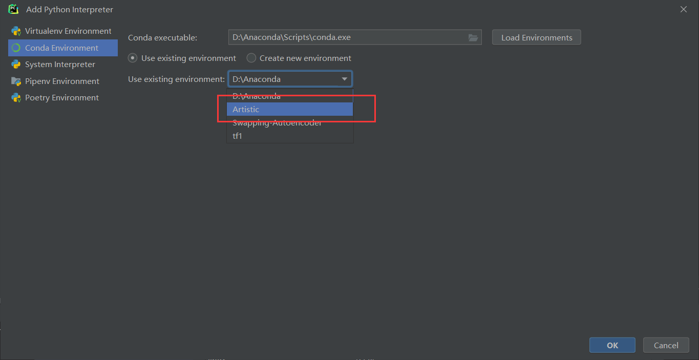
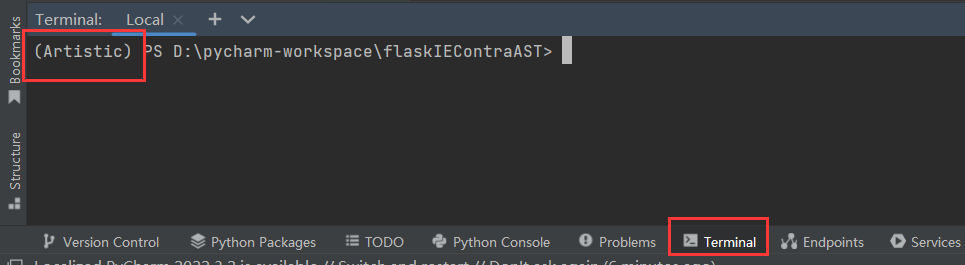

# 准备

- PyCharm 专业版

- Anaconda 

  - 创建一个虚拟环境，要求如下

    - python 3.8
    - PyTorch 1.8.0
    - CUDA 11.1


- 建议提交代码时自己创一个分支，目前只有一个 develop 分支
- 模型文件貌似上传不上来，如果 git push 卡住可以先把模型文件删掉

- 如果上传图片，可以把图片放到 README.assets 文件夹下，注意描述路径时要用斜杠（ /），用反斜杠（\）会无法显示

# 开始

## PyCharm 设置

- git clone

- 使用 PyCharm 打开该文件夹（或者可以直接在 pycharm 里面 git clone，参考 https://blog.csdn.net/hxj0323/article/details/109208253 

- file -> settings -> Project: flasklEContraAST，右边选择 Python Interpreter

  

- add interpreter ->  add local interpreter

  

- 左边选择 conda environment，右边选择自己 anaconda 安装目录下 Scripts 目录中 conda.exe 文件，下面选择 using existing environment

  

- 然后选择自己之前创建的虚拟环境（我这里是 Artistic）

  

- 最后依次点击 ok，apply，ok

- terminal 中出现虚拟环境的名字就设置成功了

  

- 有爆红的包就 pip install 即可


## 项目文件结构

```sh
├─/IEContraAST
├─app.py
├─/static
├─/templates
└─config.py

```

- /IEContraAST : 模型的依赖，见 https://github.com/HalbertCH/IEContraAST

- app.py : Flask项目的入口

- /static : 存放静态资源，如图片、css文件等

- /templates : 存放模板文件（html）

- config.py : 一些配置文件

  

## app.py

- 视图函数和路由

  - 一个路由绑定一个视图函数，如：

    ```python
    @app.route('/')
    def hello_world():  # put application's code here
        return "hello!"
    
    ```

    表示访问跟路由时（127.0.0.1:5000/），会返回字符串 Hello

  - 带参数

    ```python
    @app.route('/style/<path:content_img>')
    def style(content_img)
    ```

    这里的路由和视图函数中带了一个参数，表示文件名，可以在视图函数中调用，例如，访问 127.0.0.1:5000/style/1.jpg 时，content_img 的值为 1.jpg

  - 多个参数

    若有多个参数，可以通过 request.args.get() 来获取

    ```python
    @app.route('/style/<path:content_img>')
    def style(content_img)：
    	style_img = request.args.get("style_img")
    ```

    此时有两个参数，一个为 content_img， 另一个为 style_img，例如访问  127.0.0.1:5000/style/1.jpg?style_img=2.jpg  时，content_img 为 1.jpg，style_img 为 2.jpg。项目里是通过**重定向**来访问的：

    ```python
    return redirect(url_for('style', content_img=content_img, style_img=style_img))
    ```

    

- 渲染模板

  - 模板指 html 文件

    ```python
    @app.route('/style')
    def hello_world():  # put application's code here
        return render_template("style.html")
    
    ```

    上述代码表示在访问 127.0.0.1:5000/style 时，会渲染 style.html，即此时看到的是 style.html

  - 带参数

    ```python
    @app.route('/style')
    def hello_world():  # put application's code here
        return render_template("style.html"， form=form)
    ```

    上述代码在渲染 style.html 时带上了一个参数 form，其值为 form（两个 form 不一样，第一个 form 为参数名，第二个 form 为变量名）

    在 style.html 中通过双大括号可以使用 form，这里的 form 是一个表单对象

    ```html
    <body> 
            <form action="" method="post" enctype="multipart/form-data">
            {{ form.csrf_token }}
            选择文件 {{ form.file }} <br>
            输入风格图像{{ form.style }}
            {{ form.submit }}
        </form>
    </body>
    ```

    

- url_for

  - 静态资源必须存放在 /static 文件夹下

  - 当需要调用资源时，使用 url_for() 来指定路径，格式为：

    ```python
    url_for("static", filename=...)
    ```

    filename= 后面接文件名（字符串）

  - 显示 /static 文件夹下的某张照片：

    ```html
    
    ```

  - 指定 CSS 文件：

    ```html
     <link rel="stylesheet" href="{{  url_for("static", filename=...) } }}">
    ```


# todo

- 需要的页面为：
  - 首页 index.html
  - 上传文件的页面 * 2 （其他风格转到山水画和山水画转回其他风格）
    - style_upload.html、destyle_upload.html
    - 上传文件的框（input），以及选择风格图片（可以做一个 select ）
    - 这里可能需要显示 /style 文件夹下的风格图片
  - 风格迁移结果展示界面 result.html
- 目前 其他风格 ==> 山水画 是可以跑的，destyle_upload.html 可以先不写，这一部分模型还没有搞好